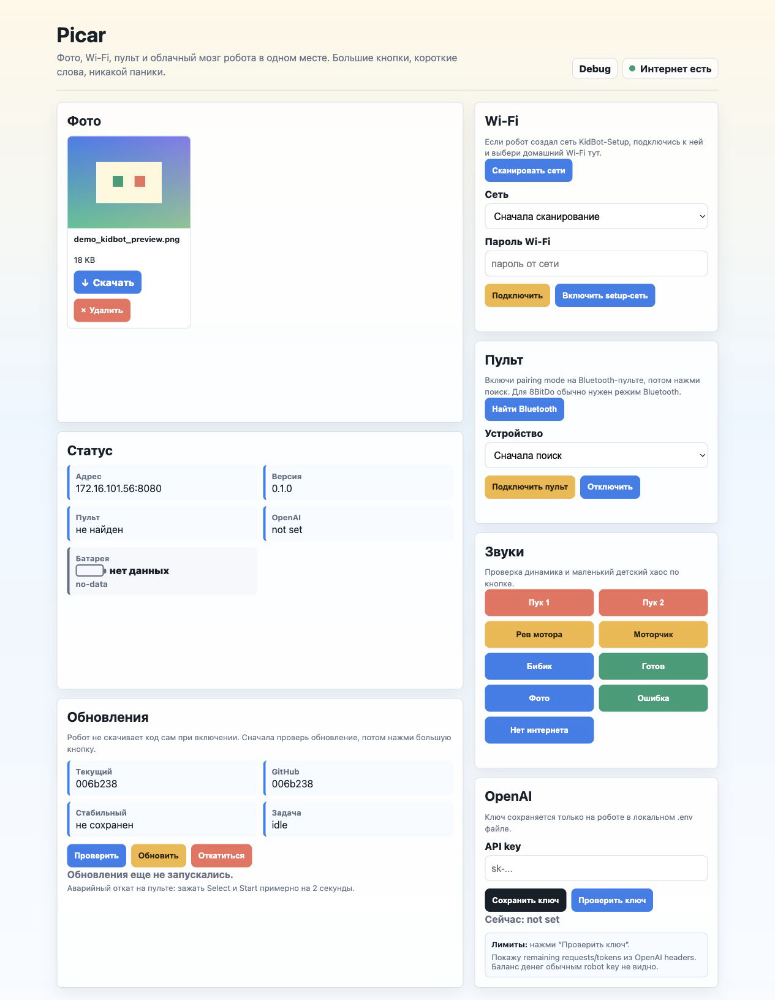
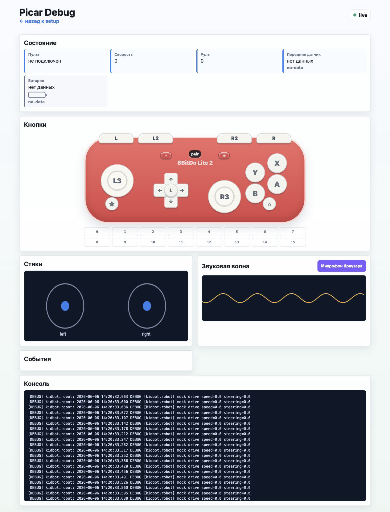

# Picar KidBot

Picar KidBot — Python-проект для робота SunFounder PiCar-X на Raspberry Pi. Он
не привязан к Raspberry Pi 3B+: подойдет любой Raspberry Pi, который работает с
PiCar-X, камерой, Bluetooth/Wi-Fi и Python. Робот ездит от Bluetooth-пульта
8BitDo Lite 2, делает фото, показывает их в локальном веб-интерфейсе,
подключается к Wi-Fi как умные камеры, играет звуки, показывает живой
debug-экран и может использовать OpenAI для чата, STT, TTS и Vision.

Мы сделали этот проект вместе с моим 7-летним сыном Ярославом. Ярослав собрал
робота и был настоящим product owner: написал продуктовую спецификацию,
проверял интерфейс, придумывал требования заказчика и честно говорил, когда
кнопки или пульт выглядят не так.

## Скриншоты

Главная страница: фото, Wi-Fi, Bluetooth-пульт, звуки, обновления, OpenAI key и
панели статуса.



Debug-страница: live-пульт 8BitDo, батарея, передний датчик, стики, микрофонная
волна, события и консоль.



## Что умеет

- Ездить от 8BitDo Lite 2 Bluetooth-геймпада с плавным рулением и скоростью.
- Делать фото, показывать их на сайте, скачивать и удалять.
- Поднимать setup Wi-Fi сеть, если робот не нашел домашний Wi-Fi.
- Сканировать Wi-Fi и подключаться к выбранной сети через сайт.
- Подключать Bluetooth-пульт через сайт.
- Сохранять `OPENAI_API_KEY` локально на роботе и проверять, что ключ работает.
- Играть звуки: мотор, бибик, готовность, ошибки и детский хаос по кнопке.
- Включать звук мотора во время движения.
- Показывать debug-страницу с WebSocket-обновлениями почти без задержки.
- Проверять обновления вручную через web UI и откатываться на стабильный build.

## Оглавление проекта

- `kidbot/kid_code/` — простые файлы, которые можно читать ребенку вместе со
  взрослым: логика езды, действия кнопок, характер робота.
- `kidbot/core/` — инфраструктура: железо, веб-сервер, Bluetooth, Wi-Fi,
  камера, AI, логи, обновления, debug-состояние.
- `assets/` — истории, музыка и звуковые эффекты.
- `tools/` — setup-скрипты и генерация sample audio.
- `tests/` — unit-тесты для поведения, веба, конфигурации и железных адаптеров.

## Установка на Raspberry Pi

Самый простой способ с Mac или Linux-компьютера:

```bash
./tools/setup_robot.sh --host pi@picar.local
```

По умолчанию скрипт клонирует публичный репозиторий по HTTPS:

```text
https://github.com/knovikov/picar.git
```

Он копирует bootstrap-команды на Raspberry Pi, ставит зависимости, запускает
`./install.sh`, включает `kidbot.service` и перезапускает сервис. Обычно reboot
не нужен: робот должен запуститься сразу после setup. Если хочется чистый
первый старт после установки системных пакетов, добавь:

```bash
./tools/setup_robot.sh --host pi@picar.local --reboot
```

Если hostname другой:

```bash
./tools/setup_robot.sh --host pi@192.168.1.42
```

Если ты используешь private fork, включи deploy-key режим:

```bash
./tools/setup_robot.sh --private --repo yourname/picar --host pi@picar.local
```

Ручной запасной способ:

```bash
cd /home/pi
git clone https://github.com/knovikov/picar.git picar
cd picar
chmod +x install.sh run.sh update.sh tools/generate_sample_audio.py
./install.sh
sudo systemctl start kidbot.service
```

Проверка на Mac или другом компьютере без робота:

```bash
python3 -m venv .venv
source .venv/bin/activate
pip install -r requirements.txt
python3 tools/generate_sample_audio.py
KIDBOT_MOCK=1 python3 -m kidbot.main
```

Открой:

```text
http://127.0.0.1:8080
```

## Веб-интерфейс

На роботе:

```text
http://picar.local:8080
```

Если hostname не открылся, нажми `R1` для статуса или выполни на Raspberry Pi:

```bash
hostname -I
```

Потом открой:

```text
http://192.168.x.x:8080
```

На главной странице можно смотреть и удалять фото, скачивать файлы, видеть
статус робота и батареи, запускать звуки, подключать Wi-Fi, подключать
Bluetooth-пульт, сохранять OpenAI key, проверять ключ и управлять обновлениями.

Debug-страница:

```text
http://picar.local:8080/debug
```

Она показывает live-состояние пульта, заряд батареи, передний датчик
расстояния, кнопки, стики, последние события, логи и звуковую волну. Данные
пульта, батареи, датчика и логов идут по WebSocket `/ws/debug` с маленькой
задержкой.

## Setup Wi-Fi

Если робот загрузился и не нашел Wi-Fi, он попробует включить точку доступа:

```text
KidBot-Setup
```

Пароль по умолчанию:

```text
kidbot1234
```

Подключись к этой сети с телефона или ноутбука и открой:

```text
http://192.168.4.1:8080
```

Там можно выбрать домашнюю Wi-Fi сеть, ввести пароль и сохранить OpenAI API key.
После подключения к домашнему Wi-Fi робот снова будет доступен по обычному IP.

Настройки лежат в `config.yaml`:

```yaml
setup_ap:
  enabled: true
  auto_start_when_no_wifi: true
  boot_check_wait_seconds: 45
  boot_check_poll_seconds: 3
  ssid: "KidBot-Setup"
  password: "kidbot1234"
  interface: "wlan0"
  address: "192.168.4.1/24"
```

При установке включается `kidbot-network-recovery.service`: после загрузки он
ждет `boot_check_wait_seconds`, и если робот не подключился к сохраненной Wi-Fi
сети, включает `KidBot-Setup`. Тогда подключись к этой сети и открой
`http://192.168.4.1:8080`.

Важно: `kidbot1234` — публичный demo-пароль. Перед настоящим использованием
лучше поменять его в `config.yaml`.

## Bluetooth-пульт

Через сайт:

1. Открой веб-интерфейс робота.
2. Включи pairing mode на Bluetooth-пульте.
3. В блоке `Пульт` нажми `Найти Bluetooth`.
4. Выбери пульт в списке.
5. Нажми `Подключить пульт`.

Ручной запасной способ:

```bash
bluetoothctl
power on
agent on
default-agent
scan on
pair XX:XX:XX:XX:XX:XX
trust XX:XX:XX:XX:XX:XX
connect XX:XX:XX:XX:XX:XX
quit
```

У 8BitDo в разных режимах могут отличаться номера осей и кнопок. Перед первой
поездкой проверь маппинг:

```bash
python3 -m tests.test_controller_print
```

## Кнопки

Когда робот едет, он сам запускает моторный звук: тихий `engine_idle.wav` на
маленькой скорости и `engine_rev.wav`, когда скорость выше.

- `A`: сделать фото и сказать “Фотография готова!”
- `B`: включить или остановить случайную музыку.
- `X`: прочитать короткую русскую историю.
- `Y`: сделать фото и смешно, но доброжелательно описать сцену.
- двойное `Y`: спокойно описать сцену.
- удержание `Y`: посмотреть влево, вперед, вправо и дать обзор.
- `Select`: очистить историю разговора.
- `Start`: аварийно остановить движение, голос и музыку.
- `L1`: push-to-talk, если доступен OpenAI.
- `R1`: проговорить статус робота.
- `L2`: искать предмет с подсказкой.
- `R2`: найти что-нибудь интересное.

Настройки моторного звука:

```yaml
engine_sound:
  enabled: true
  min_speed: 4
  rev_speed: 18
```

Если звук надоел, поставь `enabled: false`.

## OpenAI

Ключ нельзя хранить в репозитории. Его можно ввести через веб-интерфейс Picar:
он сохраняется в локальный файл `.env` с правами `600`.

Локальный вариант:

```bash
cp .env.example .env
echo 'OPENAI_API_KEY="sk-..."' >> .env
```

Кнопка `Проверить ключ` делает маленький тестовый запрос к OpenAI и показывает,
работает ли ключ, какая модель проверялась, `x-request-id` и remaining
requests/tokens, если OpenAI вернул rate-limit headers.

Важно: это не показывает денежный баланс аккаунта. Баланс, месячный spend и
подробный organization usage обычным robot API key не видны; для этого нужен
OpenAI admin key или dashboard.

Если ключа нет, Picar все равно ездит, фотографирует, открывает веб-страницу,
играет звуки, читает истории и говорит через `espeak-ng`. Chat, STT и Vision
заменяются дружелюбными offline-фразами.

## Обновления и rollback

Обновления не скачиваются автоматически при включении робота. Это сделано
специально: плохой commit не должен неожиданно приехать во время обычного
запуска.

В web UI есть блок `Обновления`:

- `Проверить` — сделать `git fetch` и показать, есть ли новый commit.
- `Обновить` — сохранить текущий commit как стабильный, сделать
  `git pull --ff-only`, обновить зависимости и перезапустить сервис.
- `Откатиться` — вернуться к сохраненному стабильному commit.

Стабильный build хранится локально:

```text
.kidbot/stable-build.json
```

Аварийный rollback без сайта: зажми `Select` и `Start` на пульте примерно на 2
секунды. Это откатит робота на сохраненную стабильную версию и перезапустит
сервис.

## Логи

Файлы лежат в `logs/`:

- `kidbot.log`
- `errors.log`
- `controller.log`
- `network.log`
- `ai.log`

Systemd-логи:

```bash
journalctl -u kidbot.service -f
journalctl -u kidbot-network-recovery.service -n 50 --no-pager
```

Локальные логи:

```bash
tail -f logs/kidbot.log logs/errors.log
```

## API маршруты

- `GET /`
- `GET /photos`
- `GET /photos/{filename}`
- `DELETE /api/photos/{filename}`
- `GET /api/status`
- `GET /api/photos`
- `GET /api/sounds`
- `POST /api/sounds/{filename}/play`
- `GET /api/wifi/scan`
- `POST /api/wifi/connect`
- `POST /api/setup/access-point`
- `GET /api/bluetooth/scan`
- `POST /api/bluetooth/connect`
- `POST /api/bluetooth/disconnect`
- `GET /api/openai-key`
- `POST /api/openai-key`
- `POST /api/openai-key/check`
- `GET /api/update/status`
- `POST /api/update/check`
- `POST /api/update/apply`
- `POST /api/update/rollback`
- `GET /debug`
- `GET /ws/debug`

## Безопасность перед public repo

В репозиторий не должны попадать:

- `.env` и любые реальные API keys.
- `.deploy-keys/` и любые private SSH keys.
- `logs/` с персональными логами.
- `photos/` с личными фотографиями.
- `.kidbot/` со стабильным локальным build state.

Эти пути уже добавлены в `.gitignore`. Для публичного проекта используйте HTTPS
clone. Deploy key нужен только для private fork и создается локально через:

```bash
./tools/setup_robot.sh --private
```

## Тесты

```bash
python3 -m tests.test_controller_print
python3 -m tests.test_drive
python3 -m tests.test_camera
python3 -m tests.test_voice
python3 -m tests.test_web_server
```

Все автоматические behavior-тесты:

```bash
python3 -m unittest -v
```

## License

MIT License. См. [LICENSE](LICENSE).
